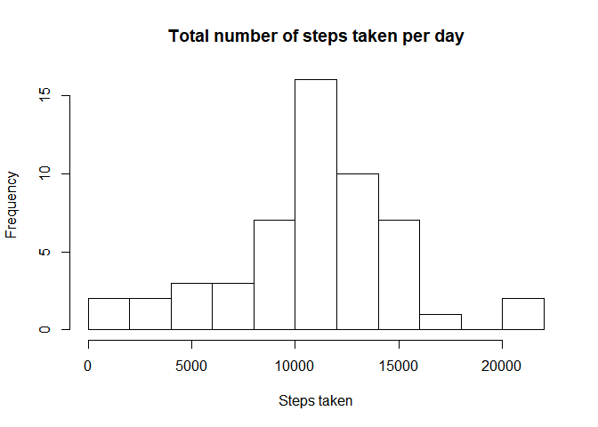
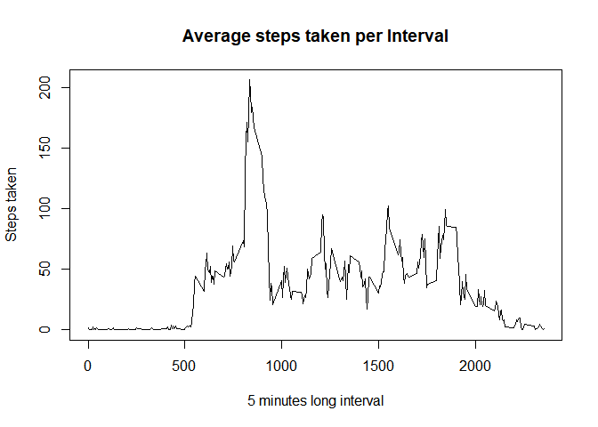
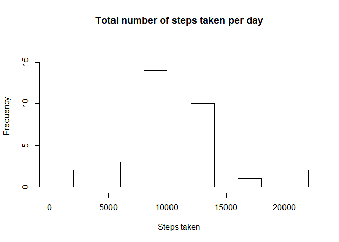
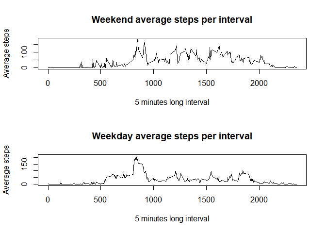

## Initial setup
Remove all variables from environment for consistent runs independent of environment

```r
rm(list=ls(all=TRUE)) 
```

## Loading and preprocessing the data
Load the data from the current working directory.

```r
data <- read.csv('activity.csv', header = T)
```

Convert date to a date instead of a factor

```r
data$date<-as.Date(data$date)
```

## What is mean total number of steps taken per day?

```r
dataStepDay <- aggregate(data$steps, by=list(data$date), FUN=sum, na.rm=F)
dataStepDayMean <- mean(dataStepDay$x, na.rm=T)
dataStepDayMedian <- median(dataStepDay$x, na.rm=T)
hist(dataStepDay$x, breaks=10,main="Total number of steps taken per day", xlab="Steps taken")
```

<!-- -->

The mean of steps taken per day is 10766. The median of steps taken per day is 10765. 


## What is the average daily activity pattern?


```r
dataStepInterval <- aggregate(data$steps, by=list(data$interval), FUN=mean, na.rm=T)
plot( x=dataStepInterval[,1],y=dataStepInterval[,2], 
      type="l",main="Average steps taken per Interval",ylab="Steps taken", xlab="5 minutes long interval")
```

<!-- -->


```r
maxVal <- dataStepInterval[which.max(dataStepInterval[,2]),1]
```

The interval with the maximum number of steps across all days is 835.

## Imputing missing values


```r
nas   <- sum(is.na(data))
compl <- sum(complete.cases(data))
```

There are  2304 incomplete rows containing NAs, leaving 15264 complete rows. 

I'll use the mice library to impute the missing values using predictive mean matching (pmm).

```r
library(mice)
```

```
## Warning: package 'mice' was built under R version 3.6.2
```

```
## Loading required package: lattice
```

```
## 
## Attaching package: 'mice'
```

```
## The following objects are masked from 'package:base':
## 
##     cbind, rbind
```

```r
imputed <- mice::mice(data, m=5, meth="pmm")
```

```
## 
##  iter imp variable
##   1   1  steps
##   1   2  steps
##   1   3  steps
##   1   4  steps
##   1   5  steps
##   2   1  steps
##   2   2  steps
##   2   3  steps
##   2   4  steps
##   2   5  steps
##   3   1  steps
##   3   2  steps
##   3   3  steps
##   3   4  steps
##   3   5  steps
##   4   1  steps
##   4   2  steps
##   4   3  steps
##   4   4  steps
##   4   5  steps
##   5   1  steps
##   5   2  steps
##   5   3  steps
##   5   4  steps
##   5   5  steps
```

```r
completeData <- mice::complete(imputed)
```


Check the mean and median of steps again, but using the clean data. We'll need to repeat the process with the clean data and aggregate the steps with date.

```r
completeDataStepsDay <- aggregate(completeData$steps, by=list(completeData$date), FUN=sum)
completeDataStepsDayMean <- mean(completeDataStepsDay$x)
completeDataStepsDayMedian <- median(completeDataStepsDay$x,)
```

The mean of steps taken per day for the cleaned dataset is 1.0556803\times 10^{4}. The median of steps taken per day is 10439.  


```r
hist(completeDataStepsDay$x, 
     breaks=10,
     main="Total number of steps taken per day", xlab="Steps taken")
```

<!-- -->

There are no big differences between the mean and median of the two datasets. The impact of imputation is negligible, it's not meant to affect the structure of data, but to make use of other data, which is not the case in this dataset.

## Are there differences in activity patterns between weekdays and weekends?

Add a column which says if the data is a weekday or a weekend.

This can get really messy depending on locale, so I'm going to convert to English locale temporarily, get the weekends as a factor, then put back the original locale.

```r
originalLocale <- Sys.getlocale(category="LC_TIME")
Sys.setlocale(category="LC_TIME","English")
```

```
## [1] "English_United States.1252"
```

```r
completeData$weekend<-as.factor(weekdays(completeData$date,abbreviate=TRUE)  %in% c("Sun", "Sat"))

Sys.setlocale(category="LC_TIME",originalLocale)
```

```
## [1] "Japanese_Japan.932"
```

Graphics of weekend and weekdays average steps per interval


```r
weekendAggregate <- aggregate(completeData[completeData$weekend==TRUE,1], by=list(completeData[completeData$weekend==TRUE,3]), FUN=mean)
weekdayAggregate <- aggregate(completeData[completeData$weekend==FALSE,1], by=list(completeData[completeData$weekend==FALSE,3]), FUN=mean)

par(mfrow=c(2,1))
plot( x=weekendAggregate[,1],y=weekendAggregate[,2], 
      type="l",main="Weekend average steps per interval",ylab="Average steps",xlab="5 minutes long interval")
plot( x=weekdayAggregate[,1],y=weekdayAggregate[,2], 
      type="l",main="Weekday average steps per interval",ylab="Average steps",xlab="5 minutes long interval")
```

<!-- -->

As seen, there is a noticeable difference, probably due to working hours.
